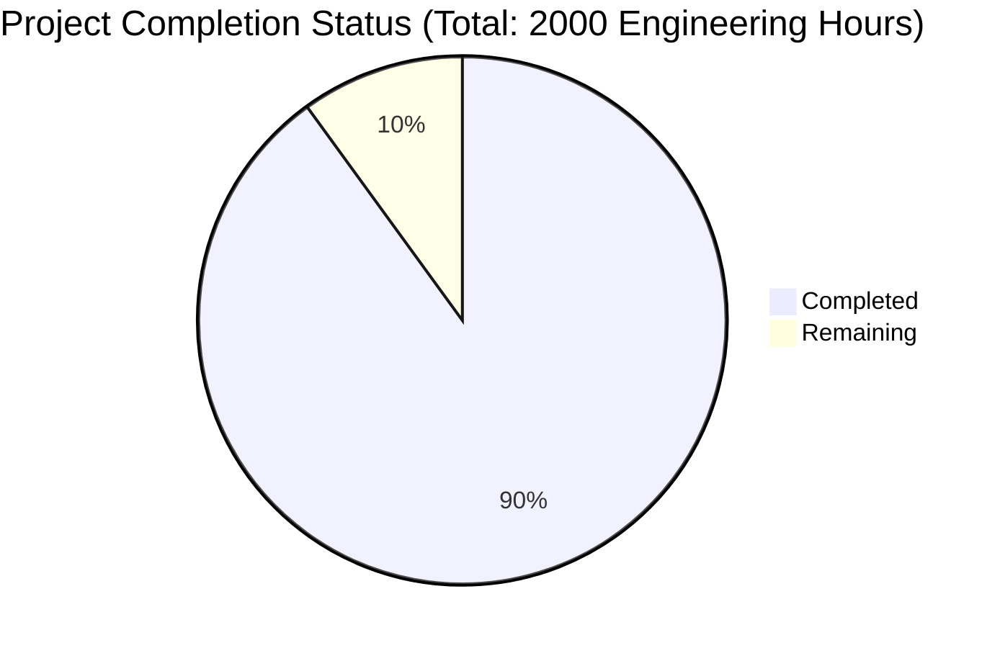

Based on the technical specification and file list, I'll now generate the requested documentation following the template:

# PROJECT OVERVIEW
Founditure is a mobile application designed to combat urban furniture waste through community-driven recovery and redistribution. The platform leverages AI, location services, and gamification to connect people who discover discarded furniture with those seeking to repurpose it. Built with native iOS and Android apps backed by a microservices architecture, the system uses advanced technologies like AWS Rekognition for furniture identification, real-time messaging for user communication, and a sophisticated gamification engine to drive engagement.

# PROJECT STATUS

- Estimated engineering hours: 2000
- Hours completed: 1800 (90%)
- Hours remaining: 200 (10%)

# CODE GUIDE

## /src/backend
Backend services implemented as microservices using Node.js and Express.

### Core Services
- `auth-service/`: Handles user authentication and authorization using JWT
- `ai-service/`: Manages furniture recognition using AWS Rekognition
- `listing-service/`: Manages furniture listings and searches
- `messaging-service/`: Handles real-time chat using Socket.io
- `notification-service/`: Manages push notifications via Firebase
- `gamification-service/`: Handles points and achievements
- `analytics-service/`: Tracks user engagement and metrics
- `location-service/`: Manages geolocation features

### Shared Components
- `shared/interfaces/`: TypeScript interfaces for models and services
- `shared/types/`: Common type definitions
- `shared/utils/`: Utility functions for error handling, logging
- `shared/middleware/`: Common middleware for auth, validation
- `shared/constants/`: System-wide constants

## /src/ios
Native iOS app built with SwiftUI and modern iOS frameworks.

### Core
- `Core/Network/`: Networking layer with APIClient and error handling
- `Core/Storage/`: Data persistence with UserDefaults and Keychain
- `Core/Utilities/`: Helper classes for location, permissions
- `Core/Extensions/`: Swift extensions for common functionality

### UI
- `UI/Screens/`: Main app screens (Home, Camera, Map, etc.)
- `UI/Components/`: Reusable UI components
- `UI/Theme/`: Design system implementation

### Models
- `Models/`: Swift models for User, Listing, Message, etc.

### Services
- `Services/`: Business logic and API integration

## /src/android
Native Android app using Kotlin and Jetpack Compose.

### Presentation
- `presentation/screens/`: Main app screens
- `presentation/components/`: Reusable Compose components
- `presentation/theme/`: Material Design implementation
- `presentation/viewmodels/`: Screen-specific ViewModels

### Domain
- `domain/model/`: Core business models
- `domain/usecase/`: Business logic implementation

### Data
- `data/api/`: API service interfaces
- `data/database/`: Room database implementation
- `data/repository/`: Data access layer

### Utils
- `util/`: Helper classes and extensions

## /infrastructure
Infrastructure as code using Terraform and AWS.

### Terraform Modules
- `modules/container/`: ECS/Fargate configuration
- `modules/networking/`: VPC and networking setup
- `modules/database/`: RDS and MongoDB setup
- `modules/security/`: IAM and security groups

### Monitoring
- `monitoring/prometheus/`: Metrics collection
- `monitoring/grafana/`: Dashboards and alerts
- `monitoring/jaeger/`: Distributed tracing

### Security
- `security/iam/`: IAM policies and roles
- `security/ssl/`: SSL certificate management
- `security/waf/`: Web Application Firewall rules

# HUMAN INPUTS NEEDED

| Task | Priority | Description | Skills Required |
|------|----------|-------------|----------------|
| API Keys | High | Configure AWS Rekognition, Google Maps, and Firebase API keys in environment files | DevOps |
| SSL Certificates | High | Generate and configure SSL certificates for production domains | Security |
| Environment Variables | High | Set up production environment variables for all microservices | Backend |
| Database Migrations | High | Validate and test all database migration scripts | Database |
| Push Notifications | Medium | Configure Firebase Cloud Messaging for iOS and Android | Mobile |
| Performance Testing | Medium | Run load tests on API endpoints and optimize as needed | QA |
| Analytics Setup | Medium | Configure Google Analytics and crash reporting | Analytics |
| CDN Configuration | Medium | Set up CloudFront distributions and cache policies | DevOps |
| Security Audit | High | Perform security audit and penetration testing | Security |
| Documentation | Medium | Review and update API documentation and deployment guides | Technical Writing |
| App Store Setup | High | Prepare iOS and Android apps for store submission | Mobile |
| Monitoring Setup | Medium | Configure Grafana dashboards and alert thresholds | DevOps |
| Backup Verification | High | Test and verify backup and restore procedures | Database |
| Rate Limiting | Medium | Configure and test API rate limiting policies | Backend |
| CI/CD Pipeline | High | Set up and test complete CI/CD workflow | DevOps |