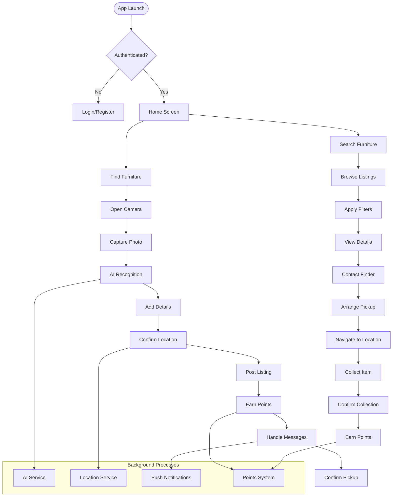
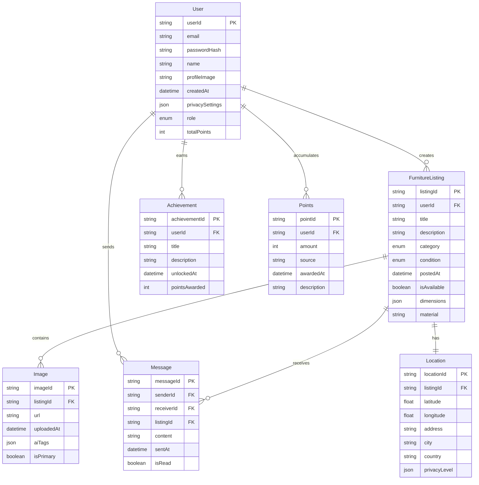
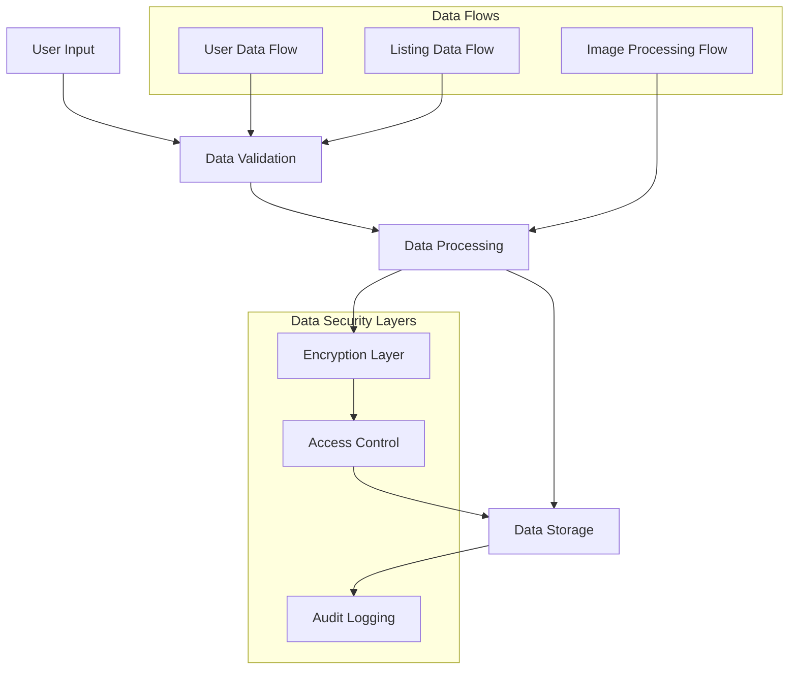

# 1. Introduction

## 1.1 Purpose

This Software Requirements Specification (SRS) document provides a detailed description of the Founditure mobile application. It is intended for:
- Development teams implementing the system
- Quality assurance teams validating requirements
- Project managers overseeing development
- Stakeholders evaluating technical specifications
- UX/UI designers creating the user interface
- System architects planning the technical infrastructure

The document establishes the basis for agreement between customers and developers on what the software product will do, serving as a blueprint for the development process.

## 1.2 Scope

Founditure is a mobile application designed to reduce urban furniture waste through community-driven recovery efforts. The system encompasses:

### Core Functionalities
- Mobile applications for iOS and Android platforms
- AI-powered furniture recognition and categorization system
- Location-based furniture discovery and mapping
- User authentication and profile management
- Gamified point system for community engagement
- Real-time messaging between users
- Push notification system for user alerts

### Key Benefits
- Reduction in urban furniture waste
- Promotion of sustainable consumption
- Creation of community-driven furniture redistribution
- Gamified incentives for environmental action
- Simplified process for furniture recovery
- Enhanced urban waste management

### System Boundaries
- Mobile application functionality
- Backend server infrastructure
- AI recognition services
- Cloud storage systems
- Authentication services
- Location services
- Push notification system

The system does not include:
- Physical furniture transportation
- Payment processing
- Furniture restoration services
- Direct integration with waste management facilities

# 2. Product Description

## 2.1 Product Perspective

Founditure operates as a standalone mobile application within the broader ecosystem of urban waste management and community-driven sustainability initiatives. The system interfaces with:

- Mobile device hardware (camera, GPS, storage)
- Cloud-based backend infrastructure
- Third-party authentication services
- AI/ML image recognition services
- Mobile push notification services
- Mapping services for location-based features

The system architecture follows a client-server model with these key components:

| Component | Description |
|-----------|-------------|
| Mobile Client | Native iOS and Android applications |
| Backend Server | Cloud-hosted API and business logic |
| AI Service | Image recognition and classification system |
| Database | Real-time data storage and retrieval |
| Storage Service | Cloud storage for user-generated content |
| Authentication Service | User identity and access management |

## 2.2 Product Functions

The primary functions of Founditure include:

- Furniture Discovery and Documentation
  - Photo capture and upload
  - AI-powered furniture recognition
  - Location tagging and mapping
  - Condition assessment
  
- User Interaction
  - Real-time messaging
  - Profile management
  - Privacy controls
  - Community engagement

- Gamification System
  - Points allocation
  - Achievement tracking
  - Leaderboard rankings
  - Reward milestones

- Location Services
  - GPS integration
  - Proximity search
  - Map visualization
  - Distance calculation

## 2.3 User Characteristics

### Furniture Finders
- Urban residents who frequently walk city streets
- Environmental activists and community organizers
- Students and young professionals
- Technical proficiency: Basic to intermediate
- Motivation: Environmental impact and community engagement

### Furniture Collectors
- Budget-conscious consumers
- DIY enthusiasts and upcyclers
- First-time home/apartment renters
- Technical proficiency: Basic to intermediate
- Motivation: Cost savings and sustainable consumption

### Community Leaders
- Environmental organization members
- Neighborhood association representatives
- Sustainability advocates
- Technical proficiency: Intermediate
- Motivation: Community improvement and waste reduction

## 2.4 Constraints

### Technical Constraints
- Mobile device hardware capabilities
- Network connectivity requirements
- Storage limitations for user-generated content
- AI processing speed and accuracy
- Battery consumption considerations

### Business Constraints
- No direct monetary transactions
- No liability for furniture quality or condition
- Geographic limitations based on user density
- Moderation resource requirements

### Regulatory Constraints
- Data privacy compliance (GDPR, CCPA)
- Location data protection
- User content rights management
- Age restrictions for user registration

## 2.5 Assumptions and Dependencies

### Assumptions
- Users have access to smartphones with cameras and GPS
- Sufficient urban population density for community engagement
- Users will participate in the gamification system
- Furniture items remain available for reasonable periods
- Community self-moderation will be partially effective

### Dependencies
- Cloud service providers' availability
- Third-party mapping service reliability
- AI service performance and accuracy
- Mobile platform update compatibility
- Network infrastructure availability
- Authentication service reliability
- Push notification service functionality



# 3. Functional Requirements

## Feature: User Authentication and Profile Management
### ID: F001
### Description
Secure user registration, authentication, and profile management system
### Priority: High
### Requirements

| ID | Requirement | Description | Priority |
|---|-------------|-------------|-----------|
| F001.1 | User Registration | Allow users to create accounts using email or social media authentication | High |
| F001.2 | User Login | Provide secure login functionality with password recovery | High |
| F001.3 | Profile Management | Enable users to edit profile information and preferences | Medium |
| F001.4 | Privacy Settings | Allow users to control visibility and sharing preferences | High |
| F001.5 | Role Selection | Support user role designation (finder/collector) | Medium |

## Feature: Furniture Documentation
### ID: F002
### Description
Comprehensive system for documenting and sharing found furniture
### Priority: High
### Requirements

| ID | Requirement | Description | Priority |
|---|-------------|-------------|-----------|
| F002.1 | Photo Capture | In-app camera functionality with multiple photo support | High |
| F002.2 | Location Tagging | Automatic GPS location tagging with manual override | High |
| F002.3 | AI Recognition | Automatic furniture type and category identification | High |
| F002.4 | Detail Entry | Manual entry fields for furniture specifications | Medium |
| F002.5 | Listing Management | Ability to edit, update, and delete furniture listings | Medium |

## Feature: Location Services
### ID: F003
### Description
Location-based functionality for furniture discovery and mapping
### Priority: High
### Requirements

| ID | Requirement | Description | Priority |
|---|-------------|-------------|-----------|
| F003.1 | Map View | Interactive map displaying available furniture items | High |
| F003.2 | Search Radius | Customizable search radius for furniture discovery | Medium |
| F003.3 | Distance Calculation | Real-time distance calculation between users and items | Medium |
| F003.4 | Location Privacy | Privacy controls for exact pickup locations | High |
| F003.5 | Navigation | Integration with mapping services for directions | Low |

## Feature: Gamification System
### ID: F004
### Description
Point-based reward system for community engagement
### Priority: Medium
### Requirements

| ID | Requirement | Description | Priority |
|---|-------------|-------------|-----------|
| F004.1 | Points Allocation | Award points for various user activities | High |
| F004.2 | Leaderboards | Global and local ranking systems | Medium |
| F004.3 | Achievements | Unlockable badges and milestones | Medium |
| F004.4 | Progress Tracking | Visual representation of user achievements | Low |
| F004.5 | Rewards | System for redeeming points or achievements | Low |

## Feature: User Communication
### ID: F005
### Description
In-app messaging and notification system
### Priority: High
### Requirements

| ID | Requirement | Description | Priority |
|---|-------------|-------------|-----------|
| F005.1 | Messaging | Real-time messaging between users | High |
| F005.2 | Push Notifications | Configurable notifications for various events | High |
| F005.3 | Content Reporting | System for reporting inappropriate content | High |
| F005.4 | Message History | Searchable message history and archive | Medium |
| F005.5 | Block Users | Ability to block and report users | High |

## Feature: Search and Discovery
### ID: F006
### Description
Advanced search functionality for furniture discovery
### Priority: High
### Requirements

| ID | Requirement | Description | Priority |
|---|-------------|-------------|-----------|
| F006.1 | Search Filters | Multiple filter options for furniture search | High |
| F006.2 | Saved Searches | Ability to save and manage search preferences | Medium |
| F006.3 | Similar Items | AI-powered similar item suggestions | Low |
| F006.4 | Category Browse | Browse furniture by category and type | Medium |
| F006.5 | Sort Options | Multiple sorting options for search results | Medium |

# 4. Non-Functional Requirements

## 4.1 Performance Requirements

| Requirement | Description | Target Metric |
|------------|-------------|---------------|
| Response Time | Maximum time for app operations | - App launch: < 3 seconds<br>- Screen transitions: < 0.5 seconds<br>- Image upload: < 4 seconds<br>- AI recognition: < 5 seconds |
| Throughput | System capacity handling | - 100,000 concurrent users<br>- 10,000 image uploads/hour<br>- 50,000 API requests/minute |
| Resource Usage | Mobile device resource consumption | - Memory usage: < 200MB active<br>- Storage: < 100MB base install<br>- Battery impact: < 5% per hour active |
| Network Performance | Bandwidth and data optimization | - Image compression: < 1MB per upload<br>- Offline functionality for core features<br>- Cached data < 50MB |

## 4.2 Safety Requirements

| Requirement | Description | Implementation |
|------------|-------------|----------------|
| Data Backup | Regular backup of user data | - Automated daily backups<br>- 30-day retention period<br>- Multiple geographic locations |
| Failure Recovery | System recovery procedures | - Automatic failover systems<br>- Data consistency checks<br>- Transaction rollback capability |
| Error Handling | Graceful error management | - User-friendly error messages<br>- Automatic error reporting<br>- Crash recovery mechanisms |
| Physical Safety | User meetup safety measures | - Safety guidelines<br>- Public meeting point suggestions<br>- Emergency contact integration |

## 4.3 Security Requirements

| Requirement | Description | Standard/Implementation |
|------------|-------------|------------------------|
| Authentication | User identity verification | - Multi-factor authentication<br>- OAuth 2.0 integration<br>- Session management |
| Authorization | Access control | - Role-based access control<br>- Granular permissions<br>- JWT implementation |
| Data Protection | Information security | - End-to-end encryption<br>- AES-256 for stored data<br>- TLS 1.3 for transmission |
| Privacy | User data privacy | - GDPR compliance<br>- Data minimization<br>- Configurable privacy settings |

## 4.4 Quality Requirements

### 4.4.1 Availability
- System uptime: 99.9%
- Planned maintenance windows: < 4 hours/month
- Recovery time objective (RTO): < 1 hour
- Recovery point objective (RPO): < 5 minutes

### 4.4.2 Maintainability
- Modular architecture
- Automated deployment pipeline
- Comprehensive documentation
- Code coverage: > 80%
- Automated testing suite

### 4.4.3 Usability
- Accessibility compliance (WCAG 2.1)
- Maximum 3 clicks to core functions
- Intuitive navigation patterns
- Multi-language support
- Consistent UI/UX patterns

### 4.4.4 Scalability
- Horizontal scaling capability
- Auto-scaling infrastructure
- Database sharding support
- Load balancing implementation
- CDN integration

### 4.4.5 Reliability
- Mean time between failures (MTBF): > 720 hours
- Mean time to repair (MTTR): < 1 hour
- Error rate: < 0.1%
- Data durability: 99.999999999%

## 4.5 Compliance Requirements

| Requirement | Standard/Regulation | Implementation |
|------------|-------------------|----------------|
| Data Protection | GDPR, CCPA | - User consent management<br>- Data deletion capability<br>- Privacy policy enforcement |
| Accessibility | WCAG 2.1 | - Screen reader support<br>- Color contrast compliance<br>- Keyboard navigation |
| Mobile Standards | iOS/Android Guidelines | - Platform-specific UI/UX<br>- App store compliance<br>- Device compatibility |
| Environmental | ISO 14001 | - Energy efficiency<br>- Resource optimization<br>- Sustainable practices |

# 5. Data Requirements

## 5.1 Data Models



## 5.2 Data Storage

### 5.2.1 Storage Requirements

| Data Type | Storage System | Retention Period | Backup Frequency |
|-----------|---------------|------------------|------------------|
| User Profiles | Primary Database | Account lifetime | Daily |
| Furniture Listings | Primary Database | 1 year after completion | Daily |
| Images | Object Storage | 1 year after listing removal | Weekly |
| Messages | Primary Database | 6 months | Daily |
| Location Data | Primary Database | Duration of listing | Daily |
| Achievement Data | Primary Database | Account lifetime | Daily |
| Points History | Primary Database | Account lifetime | Daily |

### 5.2.2 Data Redundancy

- Geographic replication across three regions
- Real-time synchronization between primary and secondary databases
- Multi-zone deployment for object storage
- Hot standby databases for immediate failover

### 5.2.3 Backup Strategy

- Automated daily incremental backups
- Weekly full backups
- 30-day backup retention
- Point-in-time recovery capability
- Encrypted backup storage
- Regular backup restoration testing

## 5.3 Data Processing



### 5.3.1 Data Security

| Security Layer | Implementation |
|---------------|----------------|
| Encryption at Rest | AES-256 encryption |
| Encryption in Transit | TLS 1.3 |
| Access Control | Role-based access control (RBAC) |
| Data Masking | PII and sensitive data masking |
| Audit Logging | Comprehensive activity logging |
| Key Management | Automated key rotation |

### 5.3.2 Data Processing Requirements

| Process | Requirement | SLA |
|---------|------------|-----|
| Image Processing | AI recognition and optimization | < 5 seconds |
| Location Processing | Geocoding and privacy filters | < 2 seconds |
| Search Indexing | Real-time index updates | < 1 second |
| Message Processing | Delivery and encryption | < 500ms |
| Points Calculation | Real-time updates | < 1 second |

# 6. External Interfaces

## 6.1 User Interfaces

### 6.1.1 Mobile Application Interface Requirements

| Screen | Core Elements | Requirements |
|--------|--------------|--------------|
| Home | - Discovery feed<br>- Search bar<br>- Navigation menu<br>- Points display | - Infinite scroll<br>- Pull-to-refresh<br>- Quick action buttons |
| Camera | - Camera preview<br>- Capture button<br>- Gallery access<br>- AI feedback overlay | - Real-time AI recognition<br>- Multiple photo capture<br>- Flash control<br>- Image stabilization |
| Map | - Interactive map<br>- Item markers<br>- Search radius control<br>- List toggle | - Clustering for multiple items<br>- Custom marker design<br>- Smooth zoom/pan<br>- Location accuracy indicator |
| Profile | - User stats<br>- Achievement badges<br>- Activity history<br>- Settings access | - Clean layout<br>- Visual achievement display<br>- Easy navigation<br>- Quick settings access |

### 6.1.2 Design Requirements

- Material Design 3 for Android
- iOS Human Interface Guidelines compliance
- Minimum touch target size: 44x44 points
- Maximum content width: 428 points
- Consistent typography system
- Accessible color contrast ratios
- Dark mode support
- Responsive layouts for all screen sizes

## 6.2 Hardware Interfaces

### 6.2.1 Mobile Device Requirements

| Component | Interface Requirements |
|-----------|----------------------|
| Camera | - Minimum 8MP resolution<br>- Auto-focus capability<br>- Flash control<br>- Image stabilization support |
| GPS | - Location accuracy within 10 meters<br>- Background location updates<br>- Power-efficient operation |
| Storage | - Access to device storage<br>- Cache management<br>- Temporary file handling |
| Network | - WiFi and cellular data access<br>- Bandwidth optimization<br>- Connection state monitoring |
| Sensors | - Accelerometer for orientation<br>- Compass for mapping<br>- Light sensor for camera adjustment |

## 6.3 Software Interfaces

### 6.3.1 External Services Integration

| Service | Interface Type | Purpose |
|---------|---------------|----------|
| Firebase | REST API | - User authentication<br>- Real-time database<br>- Push notifications |
| Google Maps | SDK | - Location services<br>- Map visualization<br>- Geocoding |
| AWS Rekognition | API | - Image recognition<br>- Object detection<br>- Content moderation |
| CloudFlare | CDN | - Image delivery<br>- Content caching<br>- DDoS protection |
| Sentry | SDK | - Error tracking<br>- Performance monitoring<br>- Crash reporting |

### 6.3.2 Data Exchange Formats

```json
{
  "furnitureListing": {
    "id": "string",
    "images": ["url"],
    "location": {
      "latitude": "float",
      "longitude": "float",
      "accuracy": "float"
    },
    "metadata": {
      "type": "string",
      "condition": "string",
      "dimensions": "object"
    }
  }
}
```

## 6.4 Communication Interfaces

### 6.4.1 Network Protocols

| Protocol | Usage | Requirements |
|----------|-------|--------------|
| HTTPS | API Communication | - TLS 1.3<br>- Certificate pinning<br>- Compression support |
| WebSocket | Real-time Messages | - Secure WebSocket (WSS)<br>- Auto-reconnection<br>- Message queuing |
| MQTT | Push Notifications | - QoS Level 1<br>- Persistent sessions<br>- Topic-based filtering |

### 6.4.2 API Requirements

- RESTful architecture
- JSON data format
- JWT authentication
- Rate limiting
- Versioning support
- CORS configuration
- Cache-Control headers
- Compression (gzip/brotli)

### 6.4.3 Error Handling

| Error Type | Response Format |
|------------|----------------|
| Validation | `{"error": "validation", "details": []}` |
| Authentication | `{"error": "auth", "message": "string"}` |
| Rate Limit | `{"error": "rate_limit", "retry_after": "int"}` |
| Server Error | `{"error": "server", "reference": "string"}` |

# APPENDICES

## A. Glossary

| Term | Definition |
|------|------------|
| Finder | User who documents and posts found furniture items |
| Collector | User who searches for and collects posted furniture items |
| Recovery | The process of collecting and repurposing discarded furniture |
| Listing | A posted furniture item with photos, location, and details |
| Points | Gamification currency earned through app activities |
| Achievement | Unlockable recognition for reaching specific milestones |
| Pickup Location | The GPS coordinates or address where furniture can be collected |

## B. Acronyms

| Acronym | Definition |
|---------|------------|
| AI | Artificial Intelligence |
| API | Application Programming Interface |
| CDN | Content Delivery Network |
| CORS | Cross-Origin Resource Sharing |
| DDoS | Distributed Denial of Service |
| GDPR | General Data Protection Regulation |
| GPS | Global Positioning System |
| JWT | JSON Web Token |
| ML | Machine Learning |
| MQTT | Message Queuing Telemetry Transport |
| PII | Personally Identifiable Information |
| QoS | Quality of Service |
| RBAC | Role-Based Access Control |
| REST | Representational State Transfer |
| SDK | Software Development Kit |
| TLS | Transport Layer Security |
| UI/UX | User Interface/User Experience |
| WCAG | Web Content Accessibility Guidelines |
| WSS | WebSocket Secure |

## C. Additional References

| Resource | Description | URL |
|----------|-------------|-----|
| Material Design 3 | Google's design system for Android | https://m3.material.io/ |
| iOS Guidelines | Apple's Human Interface Guidelines | https://developer.apple.com/design/human-interface-guidelines/ |
| Firebase Docs | Documentation for Firebase services | https://firebase.google.com/docs |
| AWS Rekognition | AI image recognition service documentation | https://aws.amazon.com/rekognition/ |
| Google Maps Platform | Location services documentation | https://developers.google.com/maps |
| Sentry Documentation | Error tracking and monitoring | https://docs.sentry.io/ |
| MQTT Specification | MQTT protocol documentation | https://mqtt.org/mqtt-specification/ |