# 1. Introduction

## 1.1 Executive Summary

Founditure is a mobile application designed to combat urban furniture waste through community-driven recovery and redistribution. The system leverages artificial intelligence, location services, and gamification to connect people who discover discarded furniture with those seeking to repurpose it. By creating a sustainable furniture recovery ecosystem, Founditure addresses the growing environmental impact of furniture waste while building engaged local communities.

The platform serves urban residents, environmental activists, and budget-conscious consumers by providing a streamlined solution for documenting, discovering, and recovering furniture items. Through its gamified approach and AI-powered features, Founditure aims to reduce landfill waste, promote sustainable consumption, and create measurable environmental impact in urban areas.

## 1.2 System Overview

### Project Context

| Aspect | Description |
|--------|-------------|
| Market Position | First-to-market community-driven furniture recovery platform |
| Target Market | Urban areas with high population density and furniture waste |
| User Base | Environmentally conscious urban residents aged 18-45 |
| Competition | Traditional marketplace apps, waste management services |
| Differentiation | AI-powered recognition, gamification, community focus |

### High-Level Description

The system architecture comprises:

- Native mobile applications (iOS/Android)
- Cloud-based backend infrastructure
- AI/ML services for image recognition
- Real-time messaging and notification system
- Location-based discovery services
- Gamification engine
- Data analytics platform

### Success Criteria

| Metric | Target |
|--------|---------|
| User Adoption | 100,000 active users in first year |
| Furniture Recovery | 50,000 items recovered annually |
| Environmental Impact | 1,000 tons of furniture waste diverted from landfills |
| User Engagement | 70% monthly active user retention |
| Community Growth | 25% month-over-month community growth |

## 1.3 Scope

### In-Scope Elements

#### Core Features

- User authentication and profile management
- AI-powered furniture recognition and categorization
- Location-based furniture discovery
- Real-time messaging between users
- Gamification system with points and achievements
- Push notification system
- Community moderation tools
- Basic analytics and reporting

#### Implementation Boundaries

| Boundary Type | Coverage |
|--------------|----------|
| Geographic | Major urban centers in North America |
| User Groups | Furniture finders and collectors |
| Device Support | iOS 14+ and Android 10+ |
| Language | English (initial release) |
| Data Types | Furniture listings, user profiles, messages |

### Out-of-Scope Elements

- Physical furniture transportation services
- Monetary transactions or payment processing
- Furniture restoration services
- Professional moving services
- Insurance or liability coverage
- Direct integration with waste management facilities
- Carbon offset calculations
- Multi-language support (initial release)
- Web application interface
- Marketplace for new furniture
- Professional seller accounts
- Integration with retail partners
- Automated furniture valuation
- AR/VR furniture visualization

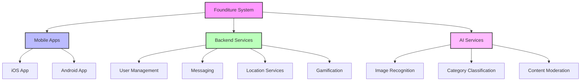

# 2. SYSTEM ARCHITECTURE

## 2.1 High-Level Architecture

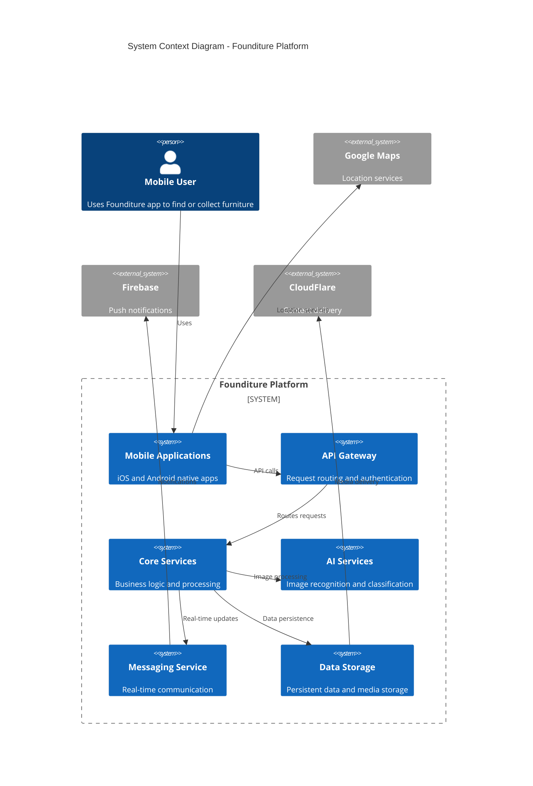

## 2.2 Component Details

### 2.2.1 Core Components

| Component | Technology Stack | Purpose | Scaling Strategy |
|-----------|-----------------|---------|------------------|
| API Gateway | Kong Gateway | Request routing, authentication, rate limiting | Horizontal scaling with load balancing |
| Core Services | Node.js, Express | Business logic, data processing | Microservices architecture with auto-scaling |
| AI Services | TensorFlow, AWS Rekognition | Image recognition, classification | Serverless functions with queue-based processing |
| Messaging Service | WebSocket, Redis | Real-time communication | Cluster deployment with pub/sub pattern |
| Data Storage | PostgreSQL, MongoDB | Structured and unstructured data storage | Database sharding and replication |

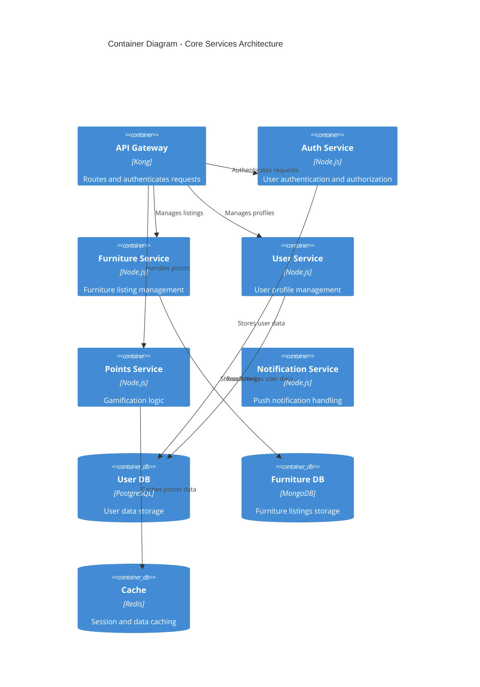

## 2.3 Technical Decisions

### 2.3.1 Architecture Patterns

| Pattern | Implementation | Justification |
|---------|---------------|---------------|
| Microservices | Domain-driven service boundaries | Scalability, maintainability, independent deployment |
| Event-Driven | Apache Kafka message bus | Asynchronous processing, system decoupling |
| CQRS | Separate read/write models | Performance optimization, scalability |
| API Gateway | Kong Gateway | Security, routing, rate limiting |

### 2.3.2 Data Storage Solutions

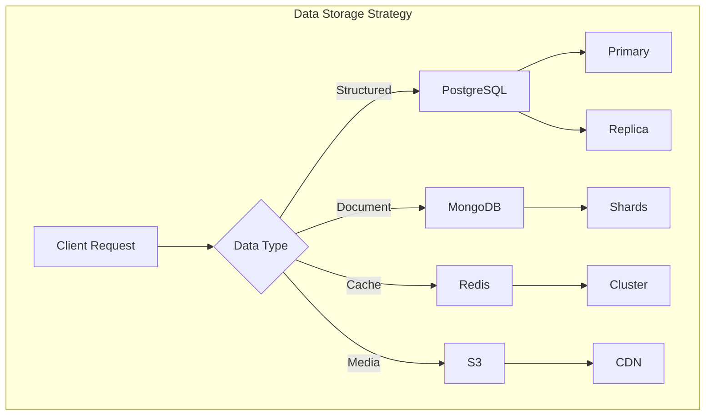

## 2.4 Cross-Cutting Concerns

### 2.4.1 System Monitoring

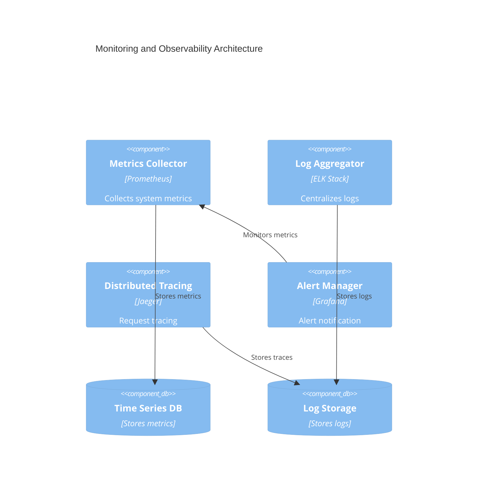

### 2.4.2 Deployment Architecture

```mermaid
deployment
    title Deployment Diagram

    node "AWS Cloud" {
        node "VPC" {
            node "Public Subnet" {
                component "Load Balancer"
                component "API Gateway"
            }
            
            node "Private Subnet" {
                component "Application Cluster"
                component "Cache Cluster"
                component "Message Queue"
            }
            
            node "Data Subnet" {
                database "Primary DB"
                database "Replica DB"
            }
        }
        
        node "CDN Edge" {
            component "CloudFront"
        }
    }
    
    node "Mobile Clients" {
        component "iOS App"
        component "Android App"
    }
```

## 2.5 Security Architecture

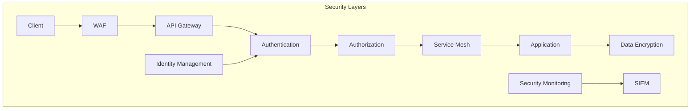

### 2.5.1 Security Controls

| Layer | Implementation | Purpose |
|-------|---------------|----------|
| Network | AWS WAF, Security Groups | DDoS protection, network isolation |
| Authentication | JWT, OAuth 2.0 | User identity verification |
| Authorization | RBAC, Service Mesh | Access control, service-to-service auth |
| Data | AES-256, TLS 1.3 | Data encryption at rest and in transit |
| Monitoring | AWS GuardDuty, CloudWatch | Security monitoring and alerting |

# 3. SYSTEM DESIGN

## 3.1 User Interface Design

### 3.1.1 Design Specifications

| Aspect | Requirement | Details |
|--------|-------------|---------|
| Visual Hierarchy | Material Design 3 | - 8dp grid system<br>- Elevation levels 0-5<br>- Dynamic color system |
| Component Library | Custom Design System | - Atomic design principles<br>- Shared component library<br>- Platform-specific variants |
| Responsive Design | Mobile-First | - Breakpoints: 320px, 375px, 428px<br>- Flexible grid layouts<br>- Adaptive typography |
| Accessibility | WCAG 2.1 AA | - Minimum contrast ratio 4.5:1<br>- Touch targets 44x44pt<br>- Screen reader support |
| Device Support | iOS/Android | - iOS 14+<br>- Android 10+<br>- Tablet optimization |
| Theme Support | Dynamic Theming | - Light/dark mode<br>- Custom color schemes<br>- Auto theme switching |
| i18n/l10n | Multi-language | - RTL support<br>- Dynamic layout adjustment<br>- Locale-specific formatting |

### 3.1.2 Interface Elements

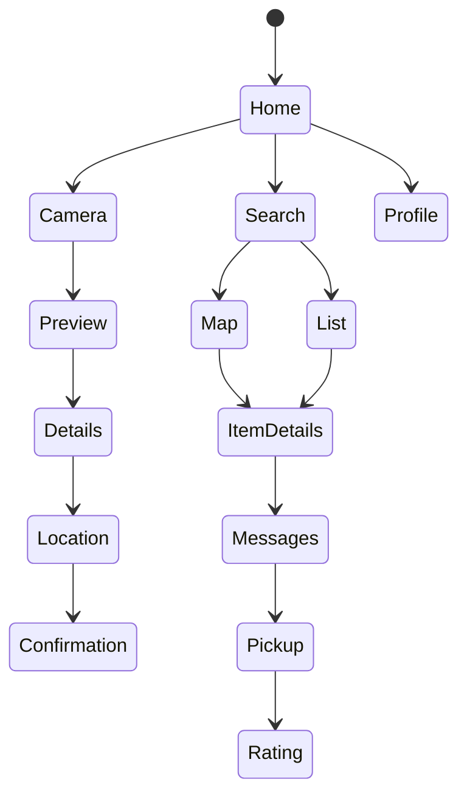

### 3.1.3 Critical User Flows

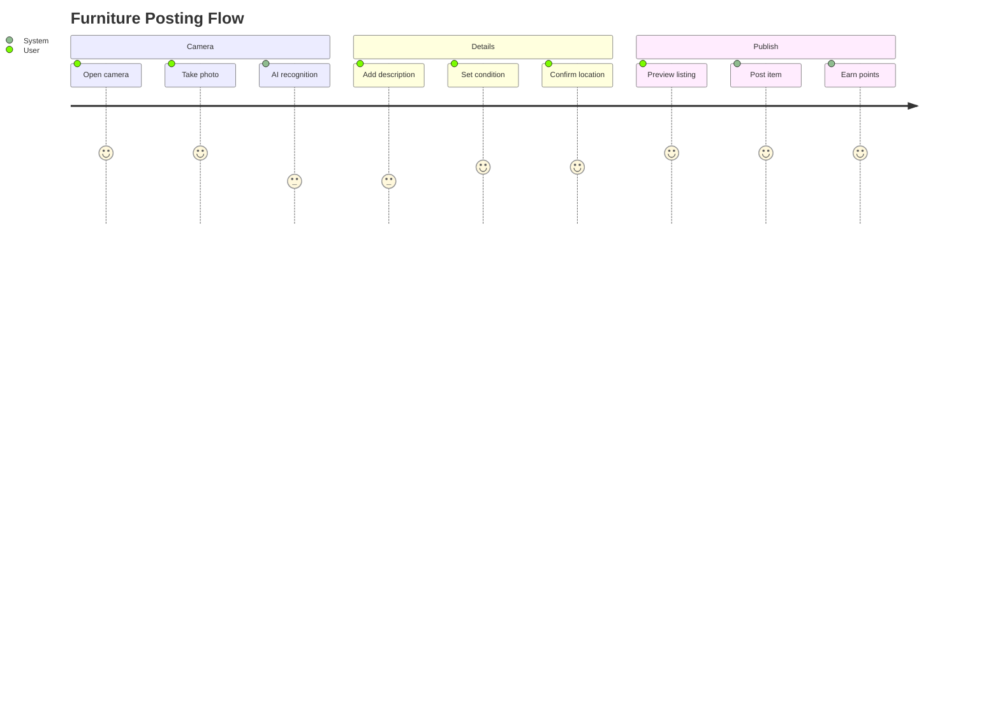

## 3.2 Database Design

### 3.2.1 Schema Design

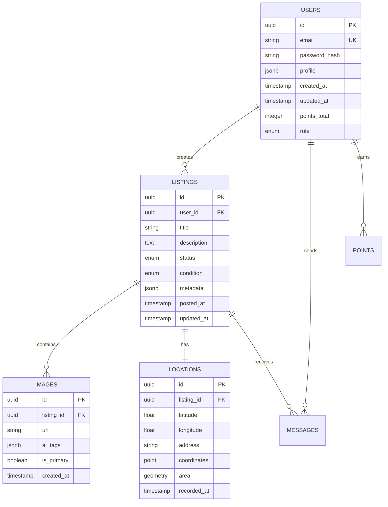

### 3.2.2 Data Management Strategy

| Aspect | Strategy | Implementation |
|--------|----------|----------------|
| Partitioning | Time-based | Monthly partitions for listings and messages |
| Indexing | Multi-column | Covering indexes for common queries |
| Archival | Cold Storage | Move inactive data after 12 months |
| Backup | Continuous | Point-in-time recovery with 30-day retention |
| Privacy | Data Masking | PII encryption and selective masking |
| Auditing | Change Data Capture | Track all data modifications |

### 3.2.3 Performance Optimization

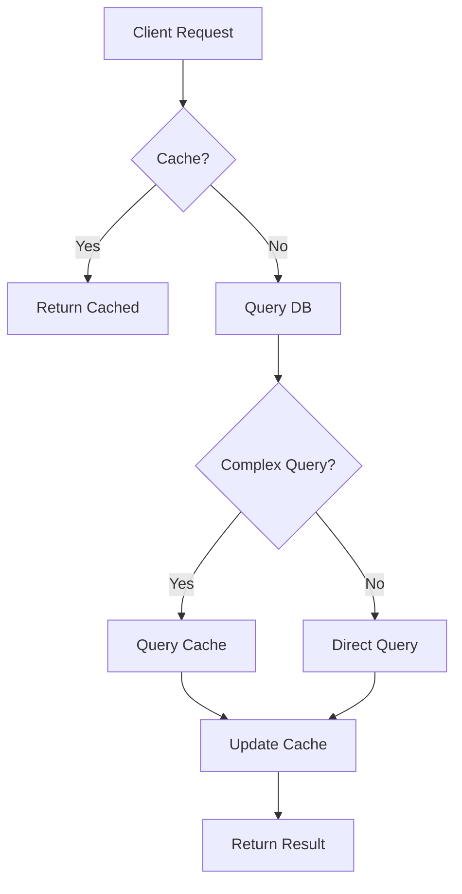

## 3.3 API Design

### 3.3.1 API Architecture

| Component | Specification | Details |
|-----------|--------------|----------|
| Protocol | REST/HTTP/2 | TLS 1.3 required |
| Authentication | JWT + OAuth2 | Refresh token rotation |
| Authorization | RBAC | Role-based permissions |
| Rate Limiting | Token Bucket | 100 requests/minute |
| Versioning | URI-based | /v1/, /v2/, etc. |
| Documentation | OpenAPI 3.0 | Auto-generated docs |

### 3.3.2 Interface Specifications

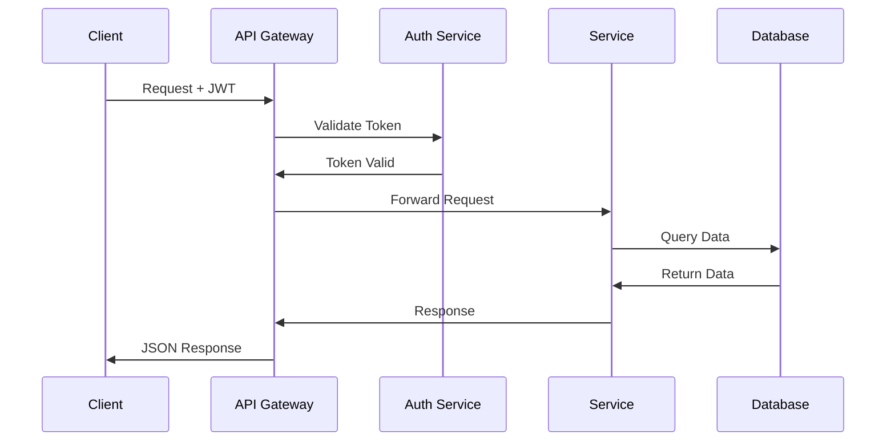

### 3.3.3 Endpoint Definitions

| Endpoint | Method | Purpose | Request Format | Response Format |
|----------|--------|---------|----------------|-----------------|
| /listings | POST | Create listing | Multipart/form-data | JSON |
| /listings/{id} | GET | Get listing | - | JSON |
| /listings/search | GET | Search listings | Query params | JSON Array |
| /users/{id}/points | GET | Get user points | - | JSON |
| /messages | POST | Send message | JSON | JSON |

### 3.3.4 Integration Requirements

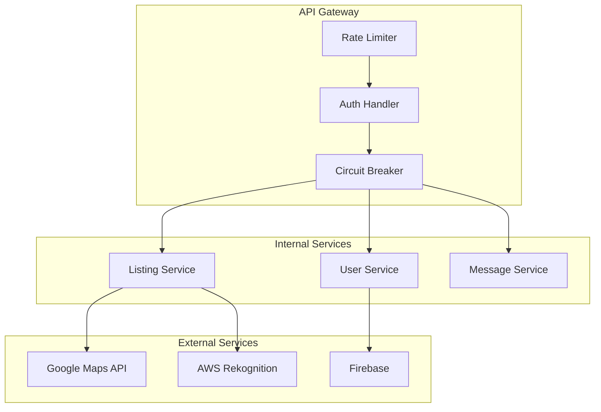

# 4. TECHNOLOGY STACK

## 4.1 PROGRAMMING LANGUAGES

| Platform/Component | Language | Version | Justification |
|-------------------|----------|---------|---------------|
| iOS | Swift | 5.9+ | - Native performance for camera/GPS<br>- Strong type safety<br>- Modern concurrency support |
| Android | Kotlin | 1.9+ | - Official Android development language<br>- Java interoperability<br>- Coroutines for async operations |
| Backend Services | Node.js | 20 LTS | - Async I/O for real-time features<br>- Large ecosystem<br>- Consistent JSON handling |
| AI Services | Python | 3.11+ | - Rich ML/AI libraries<br>- AWS SDK support<br>- Efficient image processing |

## 4.2 FRAMEWORKS & LIBRARIES

### Mobile Development

| Framework | Version | Purpose | Justification |
|-----------|---------|---------|---------------|
| SwiftUI | Latest | iOS UI | Native iOS components and performance |
| Jetpack Compose | 1.5+ | Android UI | Modern declarative UI with Kotlin support |
| React Native Maps | 1.7+ | Mapping | Cross-platform map integration |
| Vision Framework | Latest | iOS AI | Native image processing capabilities |
| MLKit | Latest | Android AI | On-device ML processing |

### Backend Development

| Framework | Version | Purpose | Justification |
|-----------|---------|---------|---------------|
| Express.js | 4.18+ | API Server | Lightweight, flexible routing |
| Socket.io | 4.7+ | Real-time Communication | Reliable WebSocket implementation |
| Prisma | 5.0+ | ORM | Type-safe database access |
| TensorFlow.js | 4.12+ | AI Processing | JavaScript-native ML capabilities |

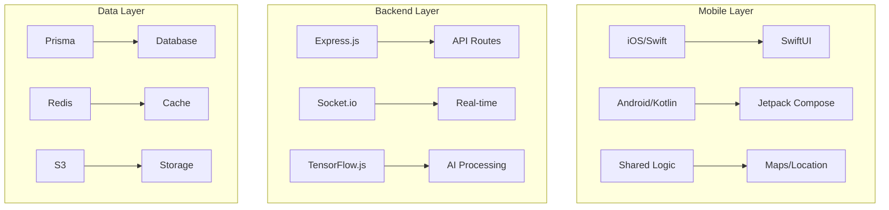

## 4.3 DATABASES & STORAGE

| Component | Technology | Version | Purpose |
|-----------|------------|---------|----------|
| Primary Database | PostgreSQL | 15+ | Structured data storage |
| Document Store | MongoDB | 6.0+ | Flexible furniture listings |
| Cache Layer | Redis | 7.0+ | Session and real-time data |
| Object Storage | AWS S3 | Latest | Image and media storage |
| Search Engine | Elasticsearch | 8.0+ | Full-text search capabilities |

### Data Flow Architecture

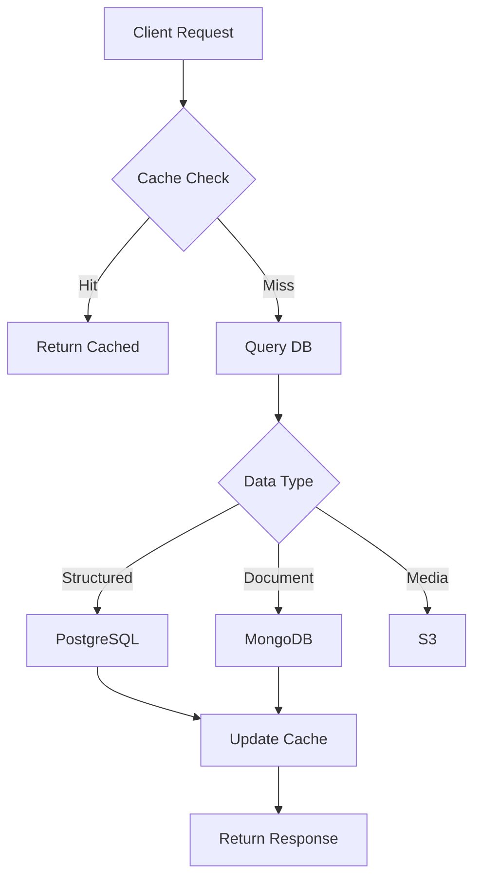

## 4.4 THIRD-PARTY SERVICES

| Service | Purpose | Integration Method |
|---------|---------|-------------------|
| AWS Rekognition | Image Analysis | AWS SDK |
| Google Maps | Location Services | Native SDKs |
| Firebase | Authentication & Push | Firebase SDKs |
| Sentry | Error Tracking | Client Libraries |
| CloudFlare | CDN & Security | DNS/Network Level |
| Stripe | Future Payment Processing | REST API |

### Service Dependencies

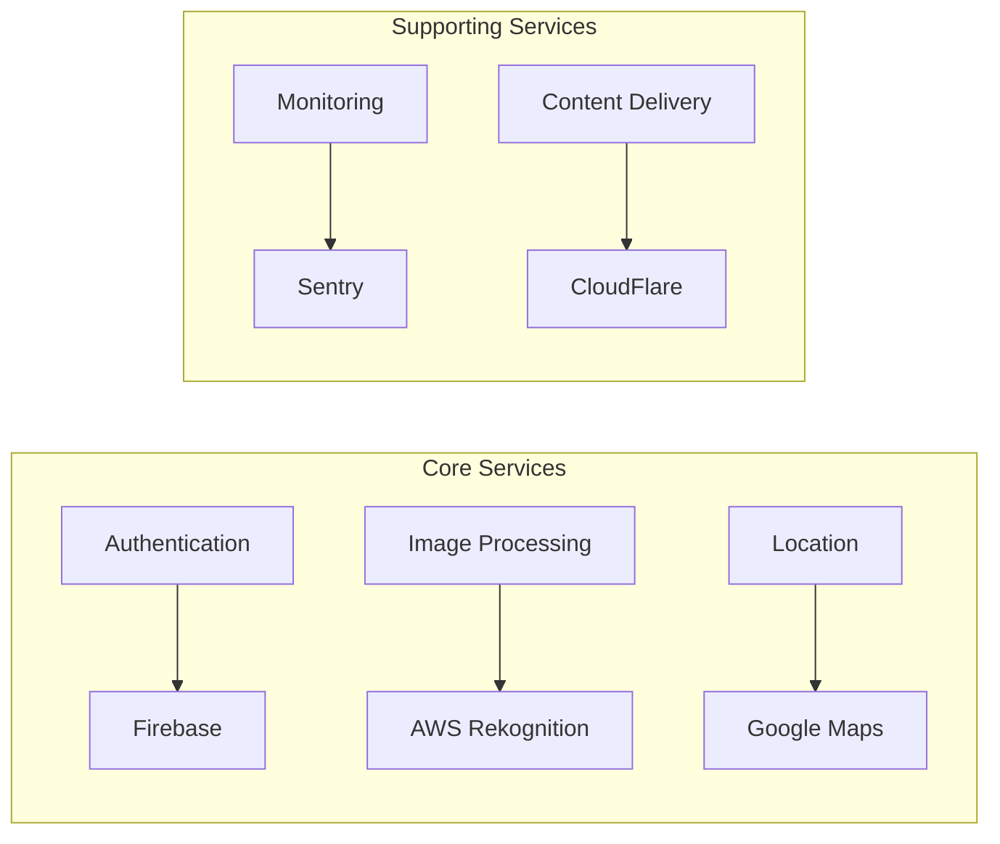

## 4.5 DEVELOPMENT & DEPLOYMENT

### Development Tools

| Category | Tool | Version | Purpose |
|----------|------|---------|----------|
| IDE | Xcode/Android Studio | Latest | Mobile Development |
| Code Editor | VS Code | Latest | Backend Development |
| Version Control | Git | 2.40+ | Source Control |
| API Testing | Postman | Latest | Endpoint Testing |

### Build & Deployment

| Component | Technology | Purpose |
|-----------|------------|----------|
| Containerization | Docker | Service isolation |
| Container Orchestration | Kubernetes | Production deployment |
| CI/CD | GitHub Actions | Automated pipeline |
| Infrastructure | Terraform | Infrastructure as code |

### Deployment Pipeline

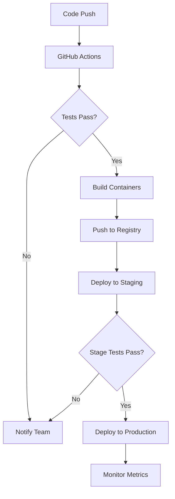

Based on the provided documentation, I'll generate the SYSTEM DESIGN section focusing on UI, Database, and API design for the Founditure mobile application.

## 3.1 User Interface Design

### 3.1.1 Design Specifications

| Aspect | Requirement | Details |
|--------|-------------|---------|
| Visual Hierarchy | Material Design 3 | - 8dp grid system<br>- Elevation levels 0-5<br>- Dynamic color system |
| Component Library | Custom Design System | - Atomic design principles<br>- Shared component library<br>- Platform-specific variants |
| Responsive Design | Mobile-First | - Breakpoints: 320px, 375px, 428px<br>- Flexible grid layouts<br>- Adaptive typography |
| Accessibility | WCAG 2.1 AA | - Minimum contrast ratio 4.5:1<br>- Touch targets 44x44pt<br>- Screen reader support |
| Device Support | iOS/Android | - iOS 14+<br>- Android 10+<br>- Tablet optimization |
| Theme Support | Dynamic Theming | - Light/dark mode<br>- Custom color schemes<br>- Auto theme switching |
| i18n/l10n | Multi-language | - RTL support<br>- Dynamic layout adjustment<br>- Locale-specific formatting |

### 3.1.2 Interface Elements


### 3.1.3 Critical User Flows


## 3.2 Database Design

### 3.2.1 Schema Design


### 3.2.2 Data Management Strategy

| Aspect | Strategy | Implementation |
|--------|----------|----------------|
| Partitioning | Time-based | Monthly partitions for listings and messages |
| Indexing | Multi-column | Covering indexes for common queries |
| Archival | Cold Storage | Move inactive data after 12 months |
| Backup | Continuous | Point-in-time recovery with 30-day retention |
| Privacy | Data Masking | PII encryption and selective masking |
| Auditing | Change Data Capture | Track all data modifications |

### 3.2.3 Performance Optimization

```mermaid
graph TD
    A[Client Request] --> B{Cache?}
    B -->|Yes| C[Return Cached]
    B -->|No| D[Query DB]
    D --> E{Complex Query?}
    E -->|Yes| F[Query Cache]
    E -->|No| G[Direct Query]
    F --> H[Update Cache]
    G --> H
    H --> I[Return Result]
```

## 3.3 API Design

### 3.3.1 API Architecture

| Component | Specification | Details |
|-----------|--------------|----------|
| Protocol | REST/HTTP/2 | TLS 1.3 required |
| Authentication | JWT + OAuth2 | Refresh token rotation |
| Authorization | RBAC | Role-based permissions |
| Rate Limiting | Token Bucket | 100 requests/minute |
| Versioning | URI-based | /v1/, /v2/, etc. |
| Documentation | OpenAPI 3.0 | Auto-generated docs |

### 3.3.2 Interface Specifications

```mermaid
sequenceDiagram
    participant C as Client
    participant G as API Gateway
    participant A as Auth Service
    participant S as Service
    participant D as Database

    C->>G: Request + JWT
    G->>A: Validate Token
    A->>G: Token Valid
    G->>S: Forward Request
    S->>D: Query Data
    D->>S: Return Data
    S->>G: Response
    G->>C: JSON Response
```

### 3.3.3 Endpoint Definitions

| Endpoint | Method | Purpose | Request Format | Response Format |
|----------|--------|---------|----------------|-----------------|
| /listings | POST | Create listing | Multipart/form-data | JSON |
| /listings/{id} | GET | Get listing | - | JSON |
| /listings/search | GET | Search listings | Query params | JSON Array |
| /users/{id}/points | GET | Get user points | - | JSON |
| /messages | POST | Send message | JSON | JSON |

### 3.3.4 Integration Requirements

```mermaid
graph TB
    subgraph "External Services"
        A[Google Maps API]
        B[AWS Rekognition]
        C[Firebase]
    end
    
    subgraph "API Gateway"
        D[Rate Limiter]
        E[Auth Handler]
        F[Circuit Breaker]
    end
    
    subgraph "Internal Services"
        G[Listing Service]
        H[User Service]
        I[Message Service]
    end
    
    D --> E
    E --> F
    F --> G
    F --> H
    F --> I
    G --> A
    G --> B
    H --> C
```

Based on the provided documentation, I'll create a detailed User Interface Design section for the Founditure mobile application.

# 3.1 User Interface Design

## 3.1.1 Design System Key

```
Icons:
[?] Help/Information
[$] Payments/Points
[i] Information
[+] Add/Create New
[x] Close/Delete
[<] Back Navigation
[>] Forward/Next
[^] Upload Photo
[#] Menu/Dashboard
[@] User Profile
[!] Alert/Warning
[=] Settings
[*] Favorite/Save

Interactive Elements:
[ ] Checkbox
( ) Radio Button
[Button] Action Button
[...] Text Input Field
[====] Progress Bar
[v] Dropdown Menu
```

## 3.1.2 Main Navigation Flow

```
+------------------------------------------+
|              Founditure                   |
|  [#] Dashboard    [@] Profile    [$] 350 |
+------------------------------------------+
|                                          |
|    [Find]    [Search]    [Messages]      |
|                                          |
+------------------------------------------+
```

## 3.1.3 Home Screen

```
+------------------------------------------+
|  [<] Back    Home    [@] Profile         |
+------------------------------------------+
|                                          |
|  [+] Post New Find                       |
|                                          |
|  Recent Finds Near You:                  |
|  +------------------------------------+  |
|  | Wooden Chair                    [*] |  |
|  | 0.5 miles away                     |  |
|  | [====] 80% Condition              |  |
|  | Posted 5m ago                     |  |
|  +------------------------------------+  |
|                                          |
|  +------------------------------------+  |
|  | Dining Table                    [*] |  |
|  | 1.2 miles away                     |  |
|  | [====] 95% Condition              |  |
|  | Posted 15m ago                    |  |
|  +------------------------------------+  |
|                                          |
+------------------------------------------+
```

## 3.1.4 Camera/Post Screen

```
+------------------------------------------+
|  [x] Cancel         Post New Find  [Next] |
+------------------------------------------+
|                                          |
|  +------------------------------------+  |
|  |                                    |  |
|  |          Camera Viewfinder         |  |
|  |                                    |  |
|  |          [^] Take Photo           |  |
|  |                                    |  |
|  +------------------------------------+  |
|                                          |
|  AI Recognition Status:                  |
|  [============    ] 75%                  |
|                                          |
|  Detected: Wooden Chair                  |
|  Condition: Good                         |
|  [i] Tap to adjust if incorrect          |
|                                          |
+------------------------------------------+
```

## 3.1.5 Item Details Form

```
+------------------------------------------+
|  [<] Back         Item Details    [Post] |
+------------------------------------------+
|                                          |
|  Title:                                  |
|  [..............................]        |
|                                          |
|  Category:                               |
|  [v] Furniture Type                      |
|  ( ) Chair    ( ) Table    ( ) Other    |
|                                          |
|  Condition:                              |
|  [====] Drag to Set                      |
|                                          |
|  Description:                            |
|  [..............................]        |
|  [..............................]        |
|                                          |
|  Location:                               |
|  [x] Current Location                    |
|  [ ] Custom Location                     |
|                                          |
+------------------------------------------+
```

## 3.1.6 Search/Map View

```
+------------------------------------------+
|  [<] Back    Search Results    [Filter]  |
+------------------------------------------+
|  [...........] Search Input              |
|                                          |
|  +------------------------------------+  |
|  |                                    |  |
|  |           Map View                 |  |
|  |           [O] Item Marker         |  |
|  |           [O] Item Marker         |  |
|  |                                    |  |
|  +------------------------------------+  |
|                                          |
|  Distance: 5 miles                       |
|  [==========] Radius Slider              |
|                                          |
|  Found 12 Items                          |
|  [List View] [Map View]                  |
|                                          |
+------------------------------------------+
```

## 3.1.7 Profile/Points Screen

```
+------------------------------------------+
|  [@] Username                    [=]     |
+------------------------------------------+
|                                          |
|  Points: 350                             |
|  [==================] Level Progress     |
|                                          |
|  Achievements:                           |
|  [*] First Find         +50 pts         |
|  [*] Quick Collector    +100 pts        |
|  [ ] Super Saver        0/500 pts       |
|                                          |
|  Recent Activity:                        |
|  +------------------------------------+  |
|  | Posted Wooden Chair     +20 pts    |  |
|  | Collected Table        +30 pts     |  |
|  | Shared Location        +10 pts     |  |
|  +------------------------------------+  |
|                                          |
+------------------------------------------+
```

## 3.1.8 Messaging Interface

```
+------------------------------------------+
|  [<] Back    Chat: Wooden Chair          |
+------------------------------------------+
|  +------------------------------------+  |
|  | Is this still available?           |  |
|  |                          10:30 AM  |  |
|  |                                    |  |
|  |            Yes, it is!            |  |
|  |            10:31 AM               |  |
|  |                                    |  |
|  | Great! Can I pick it up today?    |  |
|  |                          10:32 AM  |  |
|  +------------------------------------+  |
|                                          |
|  [...................] [Send]            |
|                                          |
|  [Arrange Pickup] [Share Location]       |
|                                          |
+------------------------------------------+
```

## 3.1.9 Responsive Design Notes

- All screens support portrait and landscape orientations
- Minimum touch target size: 44x44 points
- Dynamic text sizing based on device settings
- Flexible grid system adapts to screen sizes
- Bottom navigation remains accessible on all screens
- Floating action buttons for primary actions
- Pull-to-refresh on scrollable content
- Swipe gestures for navigation and actions

# 5. SECURITY CONSIDERATIONS

## 5.1 AUTHENTICATION AND AUTHORIZATION

### 5.1.1 Authentication Methods

| Method | Implementation | Purpose |
|--------|---------------|----------|
| Email/Password | Firebase Auth | Primary authentication method |
| Social OAuth | Google, Apple, Facebook | Alternative sign-in options |
| JWT Tokens | JSON Web Tokens | Session management |
| Biometric | TouchID/FaceID | Mobile device authentication |
| MFA | SMS/Email codes | Additional security layer |

### 5.1.2 Authorization Model

```mermaid
graph TD
    A[User Request] --> B{Authentication}
    B -->|Valid| C{Role Check}
    B -->|Invalid| D[Deny Access]
    C -->|Authorized| E[Grant Access]
    C -->|Unauthorized| D
    
    subgraph "Role Hierarchy"
        F[Admin]
        G[Moderator]
        H[Verified User]
        I[Basic User]
    end
    
    F --> G
    G --> H
    H --> I
```

### 5.1.3 Permission Matrix

| Role | Create Listings | Message Users | Moderate Content | Access Admin Panel |
|------|----------------|---------------|------------------|-------------------|
| Admin | ✓ | ✓ | ✓ | ✓ |
| Moderator | ✓ | ✓ | ✓ | ✗ |
| Verified User | ✓ | ✓ | ✗ | ✗ |
| Basic User | ✓ | Limited | ✗ | ✗ |

## 5.2 DATA SECURITY

### 5.2.1 Encryption Standards

| Data Type | At Rest | In Transit | Key Management |
|-----------|----------|------------|----------------|
| User Credentials | AES-256 | TLS 1.3 | AWS KMS |
| Personal Information | AES-256 | TLS 1.3 | AWS KMS |
| Messages | AES-256 | WSS | Firebase |
| Location Data | AES-256 | TLS 1.3 | AWS KMS |
| Media Files | Server-side Encryption | TLS 1.3 | S3 Encryption |

### 5.2.2 Data Protection Flow

```mermaid
sequenceDiagram
    participant User
    participant App
    participant API
    participant Storage
    
    User->>App: Input Data
    App->>App: Local Encryption
    App->>API: Encrypted Transfer
    API->>API: Validation
    API->>Storage: Encrypted Storage
    Storage->>Storage: Backup Encryption
    Storage->>API: Encrypted Retrieval
    API->>App: Secure Transfer
    App->>User: Decrypted Display
```

## 5.3 SECURITY PROTOCOLS

### 5.3.1 Network Security

| Layer | Protocol/Method | Implementation |
|-------|----------------|----------------|
| API Gateway | Kong Gateway | Rate limiting, IP filtering |
| Load Balancer | AWS ALB | DDoS protection, SSL termination |
| CDN | CloudFlare | WAF, DDoS mitigation |
| VPC | AWS VPC | Network isolation, security groups |
| Monitoring | AWS GuardDuty | Threat detection |

### 5.3.2 Security Controls

```mermaid
flowchart TD
    A[Security Controls] --> B[Prevention]
    A --> C[Detection]
    A --> D[Response]
    
    B --> B1[Input Validation]
    B --> B2[Access Controls]
    B --> B3[Encryption]
    
    C --> C1[Logging]
    C --> C2[Monitoring]
    C --> C3[Alerting]
    
    D --> D1[Incident Response]
    D --> D2[Backup Recovery]
    D --> D3[Security Patches]
```

### 5.3.3 Security Compliance

| Requirement | Standard | Implementation |
|-------------|----------|----------------|
| Data Privacy | GDPR/CCPA | User consent, data minimization |
| Authentication | NIST 800-63 | Strong password policy, MFA |
| API Security | OWASP API | Input validation, rate limiting |
| Cloud Security | ISO 27001 | AWS security best practices |
| Mobile Security | OWASP MASVS | App hardening, secure storage |

### 5.3.4 Security Monitoring

```mermaid
graph TB
    subgraph "Security Monitoring"
        A[Log Collection] --> B[Analysis]
        B --> C[Alerting]
        C --> D[Response]
        
        E[Real-time Monitoring]
        F[Periodic Audits]
        G[Vulnerability Scans]
        
        E --> B
        F --> B
        G --> B
    end
```

### 5.3.5 Incident Response Plan

| Phase | Actions | Responsible Team |
|-------|---------|-----------------|
| Detection | Monitor alerts, Log analysis | Security Operations |
| Containment | Isolate affected systems, Block threats | DevOps, Security |
| Eradication | Remove threat, Patch vulnerabilities | Development, Security |
| Recovery | Restore systems, Verify integrity | DevOps, QA |
| Lessons Learned | Update procedures, Improve controls | All Teams |

# 6. INFRASTRUCTURE

## 6.1 DEPLOYMENT ENVIRONMENT

The Founditure platform utilizes a cloud-native architecture deployed exclusively on AWS infrastructure to ensure scalability, reliability, and global reach.

### Environment Specifications

| Environment | Purpose | Configuration |
|------------|---------|---------------|
| Development | Feature development and testing | - Single region (us-east-1)<br>- Reduced redundancy<br>- Sandbox IAM policies |
| Staging | Pre-production testing and integration | - Multi-AZ deployment<br>- Production-like setup<br>- Restricted access |
| Production | Live application environment | - Multi-region deployment<br>- Full redundancy<br>- High availability |

```mermaid
graph TB
    subgraph "Production Environment"
        A[Route 53] --> B[CloudFront]
        B --> C[ALB]
        C --> D[ECS Cluster]
        D --> E[(RDS Multi-AZ)]
        D --> F[(ElastiCache)]
        D --> G[S3]
        H[AWS WAF] --> B
    end
    
    subgraph "Availability Zones"
        D --> AZ1[AZ-1]
        D --> AZ2[AZ-2]
        D --> AZ3[AZ-3]
    end
```

## 6.2 CLOUD SERVICES

### AWS Service Stack

| Service | Purpose | Justification |
|---------|---------|---------------|
| ECS Fargate | Container orchestration | Serverless container management |
| RDS PostgreSQL | Primary database | Managed relational database with high availability |
| ElastiCache Redis | Caching layer | In-memory caching for performance |
| S3 | Object storage | Scalable storage for user-generated content |
| CloudFront | CDN | Global content delivery and edge caching |
| Route 53 | DNS management | Global DNS with health checking |
| ECR | Container registry | Private container image storage |
| CloudWatch | Monitoring | Centralized logging and monitoring |
| AWS WAF | Security | Web application firewall protection |

## 6.3 CONTAINERIZATION

### Docker Configuration

```mermaid
graph LR
    subgraph "Container Architecture"
        A[Nginx Container] --> B[API Container]
        B --> C[Worker Container]
        D[Redis Container] --> B
        B --> E[(Database Container)]
    end
```

### Container Specifications

| Container | Base Image | Purpose |
|-----------|------------|----------|
| API | node:20-alpine | Main application server |
| Worker | node:20-alpine | Background job processing |
| Nginx | nginx:alpine | Reverse proxy and static files |
| Redis | redis:alpine | Message broker and caching |

## 6.4 ORCHESTRATION

### ECS Cluster Configuration

```mermaid
graph TB
    subgraph "ECS Architecture"
        A[Application Load Balancer] --> B[ECS Service]
        B --> C[Task Definition]
        C --> D[Container 1]
        C --> E[Container 2]
        C --> F[Container 3]
        
        subgraph "Auto Scaling"
            G[Target Tracking]
            H[Step Scaling]
        end
        
        B --> G
        B --> H
    end
```

### Orchestration Specifications

| Component | Configuration | Purpose |
|-----------|---------------|----------|
| Task Definition | CPU: 1 vCPU<br>Memory: 2GB | Resource allocation |
| Service | Desired count: 3<br>Min: 2<br>Max: 10 | High availability |
| Auto Scaling | CPU: 70%<br>Memory: 80% | Resource optimization |
| Health Check | Interval: 30s<br>Timeout: 5s | Service reliability |

## 6.5 CI/CD PIPELINE

### Pipeline Architecture

```mermaid
flowchart LR
    A[GitHub] --> B[GitHub Actions]
    B --> C{Tests Pass?}
    C -->|Yes| D[Build Images]
    C -->|No| E[Notify Team]
    D --> F[Push to ECR]
    F --> G[Deploy to Staging]
    G --> H{Stage Tests Pass?}
    H -->|Yes| I[Deploy to Prod]
    H -->|No| E
    I --> J[Health Check]
    J --> K[Route Traffic]
```

### Pipeline Stages

| Stage | Tools | Actions |
|-------|-------|---------|
| Source | GitHub | - Code checkout<br>- Branch protection<br>- PR validation |
| Build | GitHub Actions | - Dependency installation<br>- Unit tests<br>- Code quality checks |
| Test | Jest, Cypress | - Integration tests<br>- E2E tests<br>- Security scans |
| Package | Docker | - Image building<br>- Image scanning<br>- ECR push |
| Deploy | AWS CDK | - Infrastructure updates<br>- Container deployment<br>- Health checks |
| Monitor | CloudWatch | - Performance monitoring<br>- Error tracking<br>- Alerts |

### Deployment Strategy

| Environment | Strategy | Rollback Plan |
|-------------|----------|---------------|
| Staging | Blue/Green | Immediate DNS switch |
| Production | Rolling Update | Automated version rollback |
| Hotfix | Canary | Traffic percentage control |

# APPENDICES

## A. Additional Technical Information

### A.1 Development Environment Setup

| Component | Tool/Version | Configuration |
|-----------|-------------|---------------|
| iOS Development | Xcode 14+ | - Swift 5.9 toolchain<br>- iOS 14+ deployment target<br>- CocoaPods dependency manager |
| Android Development | Android Studio Electric Eel+ | - Kotlin 1.9+ plugin<br>- Gradle 8.0+<br>- Android SDK 31+ |
| Backend Development | VS Code/WebStorm | - Node.js 20 LTS<br>- npm/yarn package manager<br>- ESLint/Prettier configuration |
| Version Control | Git 2.40+ | - GitHub repository<br>- Branch protection rules<br>- Conventional commits |

### A.2 Testing Strategy

```mermaid
flowchart TD
    A[Testing Phases] --> B[Unit Testing]
    A --> C[Integration Testing]
    A --> D[E2E Testing]
    A --> E[Performance Testing]
    
    B --> B1[Jest]
    B --> B2[XCTest]
    B --> B3[JUnit]
    
    C --> C1[API Tests]
    C --> C2[Service Tests]
    
    D --> D1[Cypress]
    D --> D2[Detox]
    
    E --> E1[Load Testing]
    E --> E2[Stress Testing]
```

### A.3 Environment Configuration

| Environment | Infrastructure | Monitoring |
|-------------|---------------|------------|
| Development | - Local Docker containers<br>- Mock services<br>- Debug logging | - Local metrics<br>- Debug tools<br>- Hot reloading |
| Staging | - AWS ECS staging cluster<br>- Test databases<br>- Reduced scaling | - Full monitoring<br>- Error tracking<br>- Performance metrics |
| Production | - Multi-region deployment<br>- Auto-scaling groups<br>- High availability | - 24/7 monitoring<br>- Alerting<br>- SLA tracking |

## B. Glossary

| Term | Definition |
|------|------------|
| Finder | User who documents and shares found furniture |
| Collector | User who recovers posted furniture items |
| Listing | Furniture item post with photos and details |
| Recovery | Process of collecting and repurposing furniture |
| Points | Gamification currency earned through activities |
| Achievement | Milestone recognition in the gamification system |
| Geofence | Virtual perimeter for geographic boundaries |
| Hotspot | Area with high furniture recovery activity |
| Recognition Score | AI confidence level in furniture identification |
| Recovery Rate | Percentage of posted items successfully collected |
| Trust Score | User reliability metric based on activity |
| Community Badge | Special recognition for community contribution |

## C. Acronyms

| Acronym | Full Form | Context |
|---------|-----------|---------|
| AI | Artificial Intelligence | Image recognition system |
| API | Application Programming Interface | Service communication |
| AWS | Amazon Web Services | Cloud infrastructure |
| CDN | Content Delivery Network | Media distribution |
| CRUD | Create, Read, Update, Delete | Database operations |
| DDoS | Distributed Denial of Service | Security threat |
| ECS | Elastic Container Service | Container orchestration |
| GDPR | General Data Protection Regulation | Privacy compliance |
| GPS | Global Positioning System | Location services |
| JWT | JSON Web Token | Authentication |
| K8s | Kubernetes | Container orchestration |
| ML | Machine Learning | AI model training |
| MFA | Multi-Factor Authentication | Security feature |
| MQTT | Message Queuing Telemetry Transport | Messaging protocol |
| ORM | Object-Relational Mapping | Database abstraction |
| PII | Personally Identifiable Information | Sensitive data |
| RBAC | Role-Based Access Control | Authorization system |
| REST | Representational State Transfer | API architecture |
| SDK | Software Development Kit | Development tools |
| SLA | Service Level Agreement | Performance metrics |
| SSL | Secure Sockets Layer | Data encryption |
| TLS | Transport Layer Security | Security protocol |
| UI/UX | User Interface/User Experience | Design aspects |
| VPC | Virtual Private Cloud | Network isolation |
| WAF | Web Application Firewall | Security component |