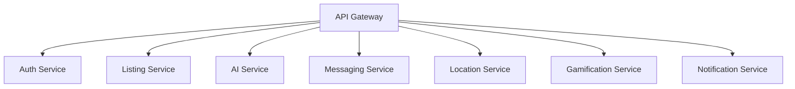

# Founditure Backend Services

> Last Updated: 2024-01-20  
> Version: 1.0.0  
> Maintainers: Backend Team, DevOps Team  
> Review Status: Approved  
> Next Review: 2024-07-20

## Table of Contents

1. [Introduction](#introduction)
2. [Architecture Overview](#architecture-overview)
3. [Getting Started](#getting-started)
4. [Development](#development)
5. [Services](#services)
6. [Deployment](#deployment)
7. [Testing](#testing)
8. [Monitoring](#monitoring)
9. [Security](#security)
10. [Contributing](#contributing)

## Introduction

### Project Overview
Founditure is a microservices-based backend system powering a mobile application designed to combat urban furniture waste through community-driven recovery and redistribution. The system leverages AI, location services, and gamification to create a sustainable furniture recovery ecosystem.

### System Architecture
The backend is built on a modern microservices architecture, utilizing Node.js and Python for various services, deployed on AWS infrastructure using containerization and orchestration technologies.

### Technical Requirements
- Node.js 20 LTS
- Docker 24.0+
- Kubernetes 1.28+
- AWS CLI 2.13+
- PostgreSQL 15+
- MongoDB 6.0+
- Redis 7.0+

### Dependencies
All services use the following core dependencies:
- Node.js Express framework for REST APIs
- Socket.IO for real-time messaging
- JWT for authentication
- AWS SDK for cloud services
- TensorFlow for AI processing

## Architecture Overview

### API Gateway (Kong Gateway)
- Request routing and load balancing
- Authentication and rate limiting
- API versioning and documentation
- SSL/TLS termination

### Auth Service (Node.js/Express)
- User authentication and authorization
- JWT token management
- OAuth2 integration
- Role-based access control (RBAC)

### Listing Service (Node.js/Express)
- Furniture listing management
- Search and filtering
- Media handling
- Location-based queries

### AI Service (Python/TensorFlow)
- Image recognition
- Furniture classification
- Content moderation
- Training pipeline

### Messaging Service (Node.js/Socket.io)
- Real-time chat
- Presence detection
- Message persistence
- Notification triggers

### Location Service (Node.js/Express)
- Geolocation processing
- Proximity search
- Address validation
- Map integration

### Gamification Service (Node.js/Express)
- Points system
- Achievement tracking
- Leaderboards
- Rewards management

### Notification Service (Node.js/Express)
- Push notifications
- Email notifications
- SMS alerts
- Notification preferences

## Getting Started

### Prerequisites
1. Install required software:
   ```bash
   # Install Node.js 20 LTS
   nvm install 20.10.0
   nvm use 20.10.0

   # Install Docker
   curl -fsSL https://get.docker.com -o get-docker.sh
   sudo sh get-docker.sh

   # Install kubectl
   curl -LO "https://dl.k8s.io/release/v1.28.0/bin/linux/amd64/kubectl"
   sudo install -o root -g root -m 0755 kubectl /usr/local/bin/kubectl

   # Install AWS CLI
   curl "https://awscli.amazonaws.com/awscli-exe-linux-x86_64.zip" -o "awscliv2.zip"
   unzip awscliv2.zip
   sudo ./aws/install
   ```

### Environment Setup
1. Clone the repository:
   ```bash
   git clone https://github.com/founditure/backend.git
   cd backend
   ```

2. Install dependencies:
   ```bash
   npm install
   ```

3. Configure environment variables:
   ```bash
   cp .env.example .env
   # Edit .env with your configuration
   ```

4. Start development services:
   ```bash
   docker-compose up -d
   ```

## Development

### Code Style Guide
- ESLint configuration with Airbnb style guide
- Prettier for code formatting
- TypeScript for type safety
- Conventional commits for version control

### Testing Requirements
- Unit tests with Jest
- Integration tests with Supertest
- E2E tests with Cypress
- Minimum 80% code coverage

### API Documentation
- OpenAPI 3.0 specification
- Swagger UI for API exploration
- Postman collections
- API versioning guidelines

### Error Handling
- Standardized error responses
- Error logging and monitoring
- Retry mechanisms
- Circuit breakers

### Logging Standards
- Structured JSON logging
- Log levels (DEBUG, INFO, WARN, ERROR)
- Request ID tracking
- Performance metrics

### Performance Guidelines
- Response time < 200ms
- API rate limiting
- Caching strategy
- Query optimization

## Services

### Service Architecture


### API Endpoints
- Detailed API documentation available at `/api/docs`
- Authentication required for protected endpoints
- Rate limiting: 100 requests/minute
- CORS configuration for mobile apps

### Data Models
- User profiles
- Furniture listings
- Messages
- Points/achievements
- Notifications
- Location data

### Service Communication
- REST APIs for synchronous communication
- Apache Kafka for event-driven communication
- WebSocket for real-time features
- gRPC for internal service communication

### Error Codes
- 4xx for client errors
- 5xx for server errors
- Custom error codes for business logic
- Error tracking with Sentry

## Deployment

### Container Configuration
- Multi-stage Docker builds
- Base images from official sources
- Security scanning with Snyk
- Resource limits and requests

### Kubernetes Setup
- EKS cluster configuration
- Helm charts for deployment
- Horizontal pod autoscaling
- Rolling updates strategy

### AWS Infrastructure
- Multi-AZ deployment
- Auto-scaling groups
- Load balancing
- Disaster recovery

### CI/CD Pipeline
- GitHub Actions workflows
- Automated testing
- Container scanning
- Blue/green deployment

### Monitoring Setup
- CloudWatch metrics
- Prometheus/Grafana
- ELK stack for logging
- Alerting configuration

## Testing

### Unit Testing
- Jest test framework
- Mock external dependencies
- Test coverage reports
- Automated CI checks

### Integration Testing
- API endpoint testing
- Database integration
- Service communication
- Authentication flows

### E2E Testing
- User journey testing
- Mobile app integration
- Performance testing
- Load testing

### Performance Testing
- Load testing with k6
- Stress testing
- Scalability testing
- Bottleneck identification

### Security Testing
- OWASP security scanning
- Penetration testing
- Vulnerability assessment
- Compliance checking

## Monitoring

### Metrics Collection
- System metrics
- Application metrics
- Business metrics
- Custom metrics

### Log Aggregation
- Centralized logging
- Log retention policy
- Log analysis
- Audit trails

### Alert Configuration
- Critical alerts
- Warning alerts
- Performance alerts
- Custom alert rules

### Performance Monitoring
- Response times
- Error rates
- Resource utilization
- User experience metrics

### Error Tracking
- Error aggregation
- Root cause analysis
- Error prioritization
- Resolution tracking

## Security

### Authentication
- JWT-based authentication
- OAuth2 integration
- MFA support
- Session management

### Authorization
- Role-based access control
- Permission management
- API key management
- Service-to-service auth

### Data Encryption
- Data at rest encryption
- TLS for data in transit
- Key management
- Encryption standards

### API Security
- Rate limiting
- Input validation
- CORS policy
- Security headers

### Compliance
- GDPR compliance
- Data privacy
- Security audits
- Compliance reporting

## Contributing

### Code Review Process
1. Create feature branch
2. Submit pull request
3. Pass automated checks
4. Peer review
5. Merge to main

### Branch Strategy
- main: production code
- develop: integration branch
- feature/*: feature branches
- hotfix/*: urgent fixes

### Commit Guidelines
- Conventional commits
- Meaningful messages
- Linked issues
- Clean history

### Documentation Updates
- README updates
- API documentation
- Architecture diagrams
- Change logs

### Release Process
1. Version bump
2. Change log update
3. Tag release
4. Deploy to staging
5. Production deployment

---

For additional information or support, contact the Backend Team or DevOps Team.